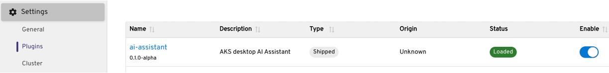
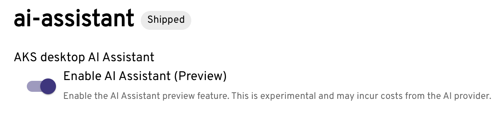
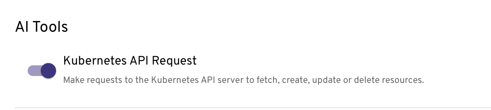
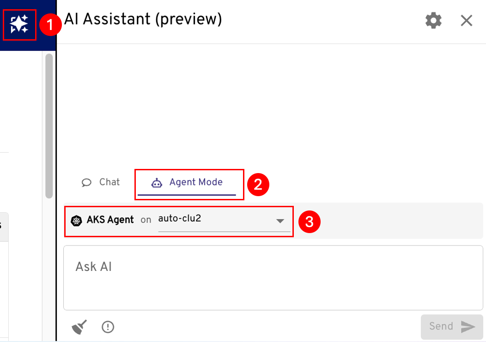
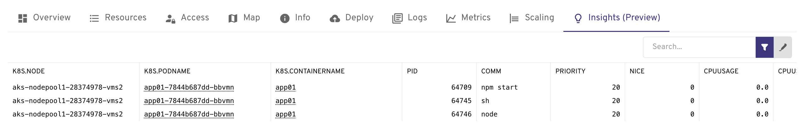
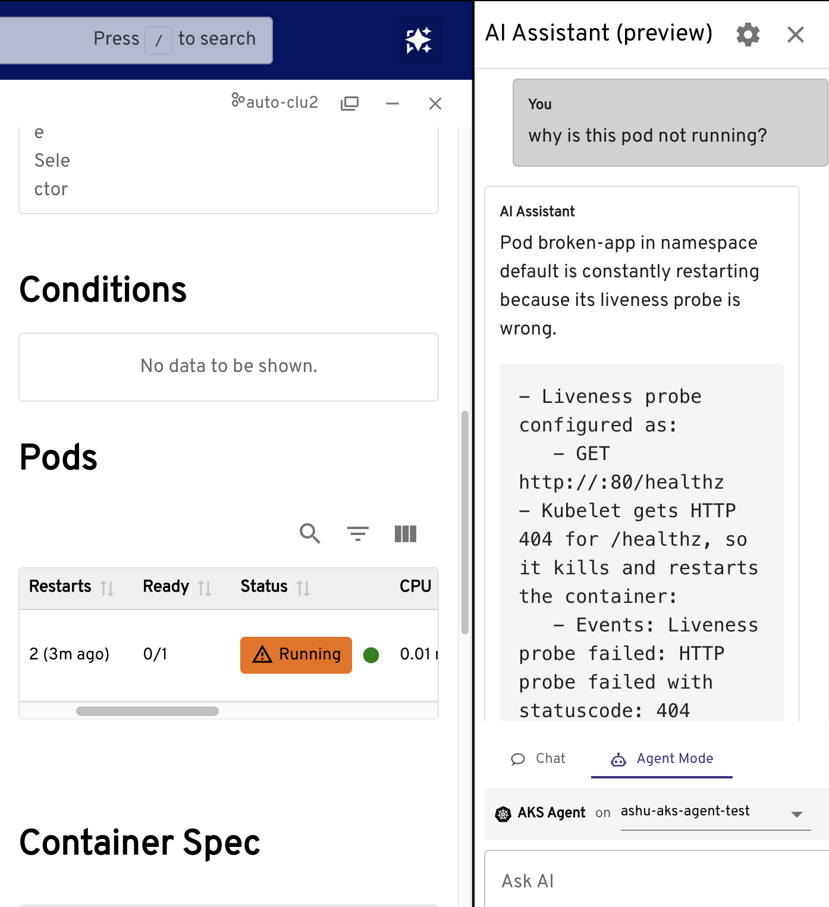
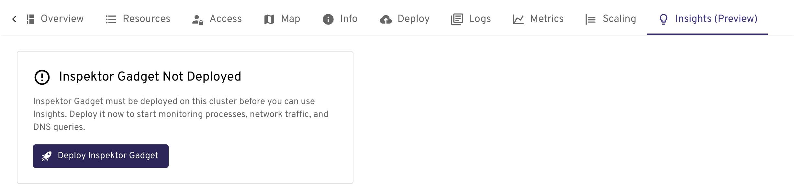
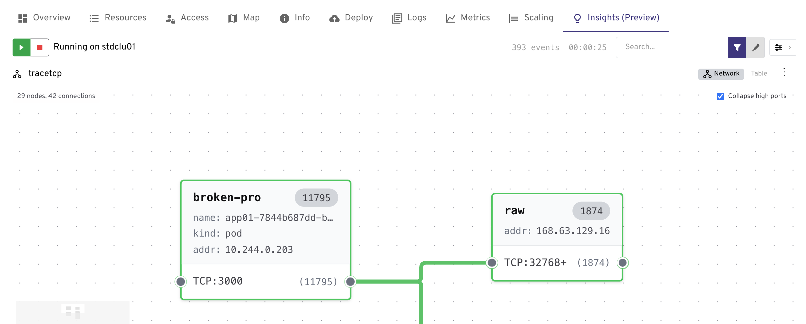
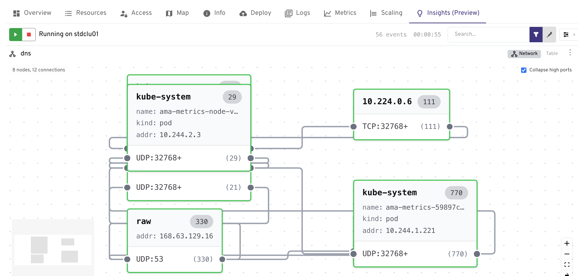
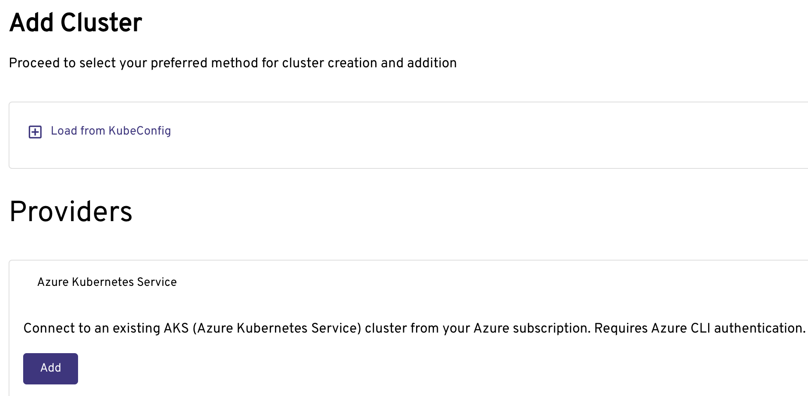

# Stable Release Notes Version 0.5.0

## Key updates in the release:
1. Accessibility, security, stability, localization and many minor fixes, documented in release notes.
2. Support for AKS Standard
3. Support for importing existing managed namespaces into AKS desktop projects.
4. Support for importing a managed namespace into a project even when the user does not have access to the cluster itself.

## Alpha Preview features
For all these new features, please provide feedback in the GitHub issues, we want to learn from you and improve! As these are preview features only run on test clusters.
1. **AI Assistant with Natural Language Support** - in context troubleshooting through asking with natural language!
2. **Insights** - identify what DNS has done now, identify top resources consumers, find networking issues with network traces, all back with a powerful UI!
3. **Automating app deployment** from AKS desktop with a GitHub Actions Pipeline - just a simple click through and edit what you need to!


## AI Assistant with Natural Language Support (Preview)
AKS Desktop Troubleshooting Assistant that brings together real-time cluster context, scoped analysis, and AI-generated recommendations to help users understand not just what happened, but why, and what to do next. 

### Addressing Key Challenges
Troubleshooting Kubernetes workloads is often complex and time consuming, it typically relies on a mix of CLI commands, dashboards, and documentation to piece together what went wrong. Common issues like DNS failures, pod crashes, and upgrade blockers can be difficult to diagnose, especially when the root cause is buried across logs, events, and configurations.

This new AI-powered experience is designed to help developers and Kubernetes operators diagnose and resolve issues in AKS clusters faster and with greater confidence, users can now investigate problems using guided, explainable insights, all within the familiar AKS Desktop interface.

 
### Functionality and Usage
The AKS Desktop Troubleshooting Assistant is built into AKS Desktop and provides a guided experience for diagnosing issues in your cluster. Users can:
* Select a project, namespace, or workload to investigate.
* Run scoped diagnostics that analyze logs, events, and metrics.
* Receive AI-generated summaries with clear reasoning and evidence.
* Preview recommended actions and apply them with confidence.
* Use your own language models or connect to Azure managed options.
* Work alongside existing dashboards in AKS Desktop for a cohesive troubleshooting experience.

> Note! This plugin is in early development and is not yet ready for production use. Using it may incur in costs from the AI provider! Use at your own risk.

### Options
There are two options for enabling this functionality:
1. Utilize the Azure AKS Agentic CLI Agent - (recommended for AKS), this an AI-powered tool (using Azure OpenAI/LLMs) that acts as an intelligent sidekick to diagnose, troubleshoot, and optimize AKS clusters using natural language queries. It provides root cause analysis and remediation suggestions, operating in local (CLI) or cluster-mode (via Helm/Kubernetes pods) for enhanced DevOps. Here AKS Desktop connects to the Agentic CLI Agent endpoint running in your selected cluster to send troubleshooting queries and receive AI-generated analysis.

2. Utilize an existing model - AKS desktop will act as an Agent itself, providing context to your model.

### Enabling the feature
1. Utilize the Azure AKS Agentic CLI Agent 
    * Go to AKS desktop settings > Plugins > Enable AI Assistant
    * [Install the Agentic CLI Agent ](https://learn.microsoft.com/en-us/azure/aks/agentic-cli-for-aks-install?tabs=client-mode%2Cclient-cleanup) on your cluster and configure it to connect to a model.
    * Ensure the cluster running the Agentic CLI Agent is a registered cluster in AKS desktop, i.e you see it in your cluster list.

2. Enable in AKS desktop
    * Go to AKS desktop settings > Plugins > Enable AI Assistant
    
    * Go to AKS desktop settings > Plugins > Enable AI Assistant > Add provider
    

3. Review AI tool Kubernetes Requests setting


### Using AI Azure AKS Agentic CLI Agent
1. Open the AI Assistant
2. Select Agent
3. Select cluster where the agent is running.
4. Start chatting!


image-8.png

### Enabling the feature
Go to Settings > Plugins ->  make sure ai-assistant plugin is enabled -> click on ai-assistant in the list of plugins -> toggle preview to enabled state. After this the ai-assistant icon should appear in the top right.

Select the cluster where the Agentic CLI Agent is running (for example, "<agent-cluster-name>") once you’ve opened the AI assistant.


### Try it out!
It is context aware, so when you see orange, errors, warnings...just ask!



 
## AKS Standard Cluster Support
In previous releases we only supported AKS Automatic, this was because Projects takes a dependency on features such as Entra enabled clusters, KEDA, Managed Prometheus, Cilium overlay etc. If you want to use existing clusters with Projects their functionality will depend on the features enabled, for example if you dont have a prometheus installed AKS desktop will not be able to show the graph metrics. This article [here](https://github.com/Azure/aks-desktop/blob/main/docs/cluster-requirements.md#aks-cluster-requirements-for-aks-desktop) discusses what each configuration enables. 

> Note! Cluster capabilties are checked when creating projects or when registering clusters, at that time we give you the opportunity to update your cluster to support them (if you have permissions), or review a doc. Before any changes to your cluster must review the  changes that the tool will make to your cluster and test them.


## AKS desktop Insights

The **Insights** feature brings real time observability to AKS Desktop via the insights-plugin powered by eBPF. It allows you to gain deep visibility into your AKS clusters directly from the desktop UI no kubectl required.

> **Note:** This feature is currently in **Preview/Alpha** and is only supported on AKS Standard clusters.

---

## Overview

The Insights plugin is built on the open source project [Inspektor Gadget](https://github.com/inspektor-gadget/inspektor-gadget) and [IG Desktop](https://github.com/inspektor-gadget/ig-desktop). It uses **eBPF** to collect granular, low-overhead data from the Linux kernel across all nodes and workloads in your cluster. This kernel level data is automatically mapped to pods, nodes, namespaces so that you can get context aware, actionable insights. 

Once enabled, an **Insights** tab appears in the project view, giving you a centralized place to explore observability data for your cluster.

---

## Prerequisites

Before enabling Insights, ensure your cluster meets the following requirements:

- An active AKS cluster connected to AKS Desktop.
- Sufficient permissions to deploy workloads to the cluster (Inspektor Gadget is deployed as a DaemonSet).
- The cluster nodes must be running a Linux kernel that supports eBPF (kernel ≥ 5.4 recommended).

---

## Enabling Insights

Follow these steps to enable the Insights feature in AKS Desktop:

### Step 1: Open AKS Desktop

Launch the AKS Desktop application and ensure you are signed in and connected to your AKS cluster.

### Step 2: Enable the Insights Plugin

1. In the left-hand navigation, click **Settings**.
2. From the Settings submenu, select **Plugins**.
3. Locate the **Insights** plugin in the list and click the **Enable** toggle to turn it on.

### Step 3: Navigate to Your Project

In the left-hand navigation, select the **Project** you want to use Insights with. The **Insights** tab will now be visible in the project view.

### Step 4: Deploy Inspektor Gadget to the Cluster

On the Insights tab, you will be prompted to deploy **Inspektor Gadget** to your cluster if it is not already installed.

1. Click **Deploy Inspektor Gadget**.
2. AKS Desktop will deploy the Inspektor Gadget DaemonSet to your cluster. 
3. Wait for the deployment to complete. A status indicator will confirm when Inspektor Gadget is ready.



### Step 5: Start Exploring Insights

Once Inspektor Gadget is deployed, the Insights tab will populate with live observability data from your cluster. You can now use the full set of Insights capabilities described below.

---

## What you can do with Insights

### Performance troubleshooting with Processes

Identify the root cause of performance issues such as:
- High CPU or memory consumption by specific pods
- Abnormal Block I/O activity


### Network visibility with Trace TCP

Monitor network traffic at the kernel level:
- See which pods are making outbound connections and to where
- Detect unexpected or unauthorized network activity
- Understand network anomalies and troubleshoot with broad network visibility



### Solve DNS issues with Trace DNS

- See which DNS queries are failing to resolve
- Identify DNS latency
- Check the health of CoreDNS and Upstream DNS


---

## Uninstalling Inspektor Gadget

If you wish to remove Inspektor Gadget from your cluster you can uninstall it manually via `kubectl`:

```bash
kubectl delete ns gadget
```

> **Note:** This will remove ALL resources in the namespace, not just those created by Inspektor Gadget.
---

## Troubleshooting

| Issue | Resolution |
|---|---|
| **Insights tab is not visible** | Ensure the Insights plugin is enabled. Go to **Settings** > **Plugins** and toggle **Insights** on. |
| **Deployment of Inspektor Gadget fails** | Verify you have sufficient RBAC permissions to create DaemonSets and ClusterRoles in the cluster. |
| **No data appears after deployment** | Confirm the cluster nodes are running a supported Linux kernel (≥ 5.4). Check the Inspektor Gadget pod logs for errors. |

---

## Additional Resources

- [Inspektor Gadget GitHub](https://github.com/inspektor-gadget/inspektor-gadget)
- [Insights Plugin GitHub](https://github.com/inspektor-gadget/insights-plugin)
- [IG Desktop GitHub](https://github.com/inspektor-gadget/ig-desktop)
- [AKS Desktop Cluster Requirements](./cluster-requirements.md)

## Automating app deployment from AKS desktop with a GitHub Actions Pipeline 
Configure a GitHub-based CI/CD pipeline for your AKS project using AKS Desktop. The pipeline uses GitHub Copilot Coding Agent to analyze your repository to provide you with a Dockerfile, K8s manifests (if required) based on your app, containerize your application, and deploy it to Azure Kubernetes Service — all from within AKS Desktop.


This [article](deployment-pipeline-create.md) walks you through the end to end. We are working supporting additional pipelines too, stay tuned and let us know any requests you have through GitHub issues on the repo.


## Awareness / updates
## Opening the app for the first time
When you download the app and open it for the first time it will open the 'clusters' view, you will see clusters here that are in your kubeconfig. You can click on the clusters and explore them, note, it is your existing identity and permissions that are used to interact with the clusters, so if you dont have the correct permissions to access clusters and their resources you will see these errors surface in AKS desktop.


Note it takes a few seconds for the screen to read 'projects' as we need to enumerate which projects you have access to.

## Sign In
To add existing Azure clusters you will need to sign in, this flow supports multi-factor authentication.


## Adding a cluster updates
You can add a cluster by selecting 'Add Cluster from Azure' using 'Add Cluster' and selecting Azure Kubernetes Service (AKS). You will then need to select your subscription.



## Project Updates
Projects are detailed [here](https://learn.microsoft.com/azure/aks/aks-desktop-app#create-a-new-project-in-aks-desktop).

### Project Type updates
Projects are built on namespaces, these are the options:
1. Existing Namespace - you can bring a namespace into a project.
2. Create New AKS Managed Namespace (recommended) - this is built on [AKS Managed Namespace](https://learn.microsoft.com/en-us/azure/aks/concepts-managed-namespaces) which provides many benefits, e.g. resource quota, network policy etc.
> Note! When you select 'New AKS Managed Namespace' we will check if the cluster meets the minimum requirements to create a project, requirements are documented [here](https://github.com/Azure/aks-desktop/blob/main/docs/cluster-requirements.md#aks-cluster-requirements-for-aks-desktop).

### Access
Note: at this point we grant the RBAC permissions to the underlying [AKS Managed Namespace](https://learn.microsoft.com/en-us/azure/aks/concepts-managed-namespaces) that AKS desktop has created on your behalf.


## Delete Project
To delete a project, select the 'Trash' icon. If you also delete the namespace, this can take a minute or so because it is an Azure request that deletes the AKS Managed Namespace.


